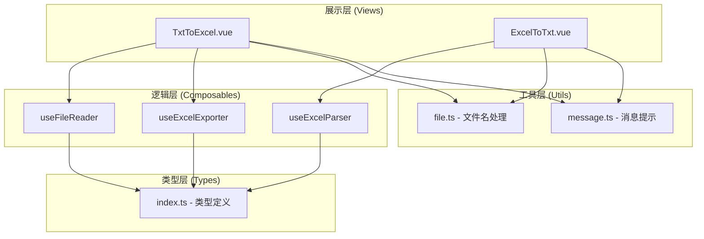
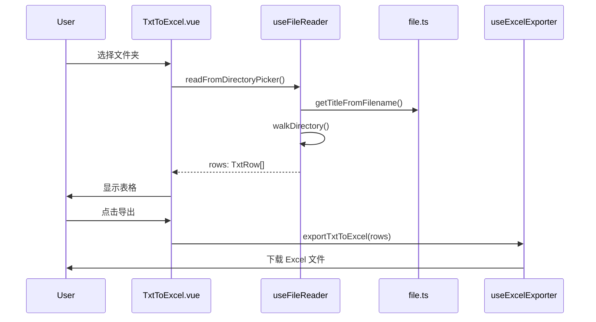
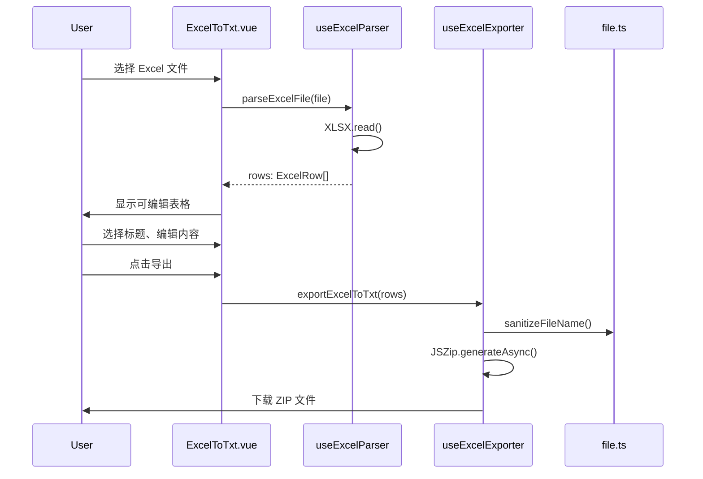

# 设计文档：Tools-Hub 项目优化

## 1. 概述

### 1.1 设计目标
本设计文档旨在为 Tools-Hub 项目优化提供详细的技术方案，确保：
- 代码结构清晰、模块化、可维护
- 依赖管理规范、版本明确
- 开发体验良好（自动导入、类型提示、代码格式化）
- 符合开源项目标准（文档、配置、License）

### 1.2 设计原则
1. **渐进式优化**：保持现有功能完整性，不引入破坏性变更
2. **职责分离**：视图层、业务逻辑、工具函数各司其职
3. **类型安全**：充分利用 TypeScript 提供类型保障
4. **约定优于配置**：遵循 Vue 3 和 Vite 的最佳实践
5. **开发者友好**：完善的注释、文档和错误提示

---

## 2. 架构设计

### 2.1 整体架构



### 2.2 目录结构设计

```
src/
├── assets/               # 静态资源
│   └── vue.svg
├── components/           # 可复用组件（未来扩展）
├── composables/          # Vue 组合式函数
│   ├── useFileReader.ts      # 文件读取逻辑
│   ├── useExcelParser.ts     # Excel 解析逻辑
│   └── useExcelExporter.ts   # Excel 导出逻辑
├── router/               # 路由配置
│   └── index.ts
├── styles/               # 全局样式
│   ├── _variables.scss       # SCSS 变量
│   └── index.scss            # 全局样式
├── types/                # TypeScript 类型定义
│   └── index.ts
├── utils/                # 工具函数
│   ├── file.ts               # 文件处理工具
│   └── message.ts            # 消息提示封装
├── views/                # 页面组件
│   ├── TxtToExcel.vue
│   └── ExcelToTxt.vue
├── App.vue               # 根组件
├── main.ts               # 应用入口
├── auto-imports.d.ts     # 自动生成（Git 忽略）
└── components.d.ts       # 自动生成（Git 忽略）
```

---

## 3. 核心模块设计

### 3.1 类型定义 (`src/types/index.ts`)

```typescript
/**
 * TXT 转 Excel 的数据行类型
 */
export interface TxtRow {
  title: string;
  content: string;
}

/**
 * Excel 转 TXT 的数据行类型
 */
export interface ExcelRow {
  title1: string;
  title2: string;
  title3: string;
  title4: string;
  title5: string;
  title6: string;
  title7: string;
  title8: string;
  title9: string;
  title10: string;
  content: string;
  selectedTitleIndex: number | null;
}

/**
 * 文件读取选项
 */
export interface FileReadOptions {
  maxChars?: number;
  accept?: string;
}

/**
 * 文件系统 API 入口类型
 */
export interface FileSystemDirectoryEntry {
  kind: 'file' | 'directory';
  name: string;
  getFile(): Promise<File>;
  entries(): AsyncIterableIterator<[string, FileSystemDirectoryEntry]>;
}
```

### 3.2 工具函数设计

#### 3.2.1 文件处理工具 (`src/utils/file.ts`)

```typescript
/**
 * 从文件名中提取标题（去除扩展名）
 * @param filename - 文件名
 * @returns 不含扩展名的标题
 */
export function getTitleFromFilename(filename: string): string {
  const lastDotIndex = filename.lastIndexOf('.');
  return lastDotIndex > 0 ? filename.slice(0, lastDotIndex) : filename;
}

/**
 * 清理文件名，移除非法字符
 * @param name - 原始文件名
 * @returns 清理后的文件名
 */
export function sanitizeFileName(name: string): string {
  return name.replace(/[\\/:*?"<>|\n\r\t]/g, '_').trim() || 'untitled';
}

/**
 * 从相对路径推断根目录名称
 * @param paths - 相对路径数组
 * @returns 根目录名称或 null
 */
export function inferRootDir(paths: string[]): string | null {
  const firstSegments = paths
    .map((p) => (p.includes('/') ? p.split('/')[0] : ''))
    .filter((seg) => seg);
  
  if (firstSegments.length === 0) return null;
  
  const candidate = firstSegments[0];
  const allSame = firstSegments.every((s) => s === candidate);
  return allSame ? candidate : null;
}

/**
 * 读取文件内容为文本
 * @param file - File 对象
 * @returns Promise<string>
 */
export function readFileAsText(file: File): Promise<string> {
  return new Promise((resolve, reject) => {
    const reader = new FileReader();
    reader.onload = () => resolve(String(reader.result ?? ''));
    reader.onerror = () => reject(reader.error ?? new Error('读取文件失败'));
    reader.readAsText(file);
  });
}
```

#### 3.2.2 消息提示封装 (`src/utils/message.ts`)

```typescript
import { ElMessage, ElMessageBox } from 'element-plus';
import type { MessageOptions } from 'element-plus';

/**
 * 成功消息
 */
export function showSuccess(message: string, options?: Partial<MessageOptions>) {
  ElMessage.success({ message, ...options });
}

/**
 * 错误消息
 */
export function showError(message: string, options?: Partial<MessageOptions>) {
  ElMessage.error({ message, ...options });
}

/**
 * 警告消息
 */
export function showWarning(message: string, options?: Partial<MessageOptions>) {
  ElMessage.warning({ message, ...options });
}

/**
 * 提示消息
 */
export function showInfo(message: string, options?: Partial<MessageOptions>) {
  ElMessage.info({ message, ...options });
}

/**
 * 确认对话框
 */
export function showConfirm(message: string, title = '提示') {
  return ElMessageBox.confirm(message, title, {
    type: 'warning',
    confirmButtonText: '确定',
    cancelButtonText: '取消',
  });
}

/**
 * 错误弹窗
 */
export function showErrorDialog(message: string, title = '错误') {
  return ElMessageBox.alert(message, title, {
    type: 'error',
    confirmButtonText: '确定',
  });
}
```

### 3.3 Composables 设计

#### 3.3.1 文件读取 Hook (`src/composables/useFileReader.ts`)

```typescript
import { ref } from 'vue';
import type { Ref } from 'vue';
import type { TxtRow, FileReadOptions } from '@/types';
import { readFileAsText, getTitleFromFilename, inferRootDir } from '@/utils/file';
import { showSuccess, showWarning, showError } from '@/utils/message';

export function useFileReader(options: FileReadOptions = {}) {
  const { maxChars = 300000, accept = '.txt' } = options;
  
  const loading = ref(false);
  const rows = ref<TxtRow[]>([]);
  const selectedFolderName = ref('');
  const selectedFolderPath = ref('');

  /**
   * 通过 input[type=file] 选择文件
   */
  async function readFromFileInput(fileList: FileList | null) {
    if (!fileList || fileList.length === 0) return;

    loading.value = true;
    try {
      const allFiles = Array.from(fileList);
      const relativePaths = allFiles.map((f) => (f as any).webkitRelativePath || f.name);
      const inferredRoot = inferRootDir(relativePaths);
      selectedFolderName.value = inferredRoot || '';
      selectedFolderPath.value = inferredRoot || '';

      const txtFiles = allFiles.filter((f) => f.name.toLowerCase().endsWith(accept));
      if (txtFiles.length === 0) {
        showWarning(`未找到 ${accept} 文件`);
        return;
      }

      const results = await Promise.all(
        txtFiles.map(async (file) => {
          try {
            const text = await readFileAsText(file);
            const title = getTitleFromFilename(file.name);
            const content = text.length > maxChars ? text.slice(0, maxChars) : text;
            return { title, content } as TxtRow;
          } catch (err) {
            console.error('读取失败: ', file.name, err);
            return null;
          }
        })
      );

      rows.value = results.filter((v): v is TxtRow => v !== null);
      
      if (rows.value.length === 0) {
        showError(`无法读取任何 ${accept} 文件`);
      } else {
        showSuccess(`已读取 ${rows.value.length} 个文件`);
      }
    } finally {
      loading.value = false;
    }
  }

  /**
   * 通过 File System Access API 选择目录
   */
  async function readFromDirectoryPicker() {
    const anyWindow = window as any;
    if (typeof anyWindow.showDirectoryPicker !== 'function') {
      throw new Error('当前浏览器不支持 File System Access API');
    }

    try {
      const dirHandle = await anyWindow.showDirectoryPicker();
      selectedFolderName.value = String(dirHandle?.name || '');
      selectedFolderPath.value = selectedFolderName.value;
      
      loading.value = true;
      const collected: TxtRow[] = [];
      
      for await (const [, entry] of (dirHandle as any).entries()) {
        await walkDirectory(entry, collected);
      }
      
      rows.value = collected;
      
      if (rows.value.length === 0) {
        showWarning(`所选文件夹内未找到 ${accept} 文件`);
      } else {
        showSuccess(`已读取 ${rows.value.length} 个文件`);
      }
    } catch (err) {
      if ((err as any)?.name !== 'AbortError') {
        console.warn('目录选择失败: ', err);
        throw err;
      }
    } finally {
      loading.value = false;
    }
  }

  /**
   * 递归遍历目录
   */
  async function walkDirectory(entry: any, output: TxtRow[]) {
    if (!entry) return;
    
    if (entry.kind === 'file') {
      const file = await entry.getFile();
      const name: string = String(file?.name || '');
      if (!name.toLowerCase().endsWith(accept)) return;
      
      const text = await file.text();
      const title = getTitleFromFilename(name);
      const content = text.length > maxChars ? text.slice(0, maxChars) : text;
      output.push({ title, content });
      return;
    }
    
    if (entry.kind === 'directory') {
      for await (const [, child] of entry.entries()) {
        await walkDirectory(child, output);
      }
    }
  }

  /**
   * 清空数据
   */
  function clear() {
    rows.value = [];
    selectedFolderName.value = '';
    selectedFolderPath.value = '';
  }

  return {
    loading,
    rows,
    selectedFolderName,
    selectedFolderPath,
    readFromFileInput,
    readFromDirectoryPicker,
    clear,
  };
}
```

#### 3.3.2 Excel 解析 Hook (`src/composables/useExcelParser.ts`)

```typescript
import { ref } from 'vue';
import * as XLSX from 'xlsx';
import type { ExcelRow } from '@/types';
import { showSuccess, showWarning, showError } from '@/utils/message';

export function useExcelParser() {
  const rows = ref<ExcelRow[]>([]);
  const titleHeaders = ref<string[]>([]);

  /**
   * 解析 Excel 文件
   */
  async function parseExcelFile(file: File) {
    try {
      const data = await file.arrayBuffer();
      const workbook = XLSX.read(data, { type: 'array' });
      const worksheet = workbook.Sheets[workbook.SheetNames[0]];

      // 获取表头
      const headerRow = XLSX.utils.sheet_to_json<any>(worksheet, {
        header: 1,
        defval: '',
      })[0] as any[];
      const headers: string[] = headerRow || [];

      // 确定列数
      const totalCols = headers.length;
      if (totalCols < 11) {
        showWarning(
          `Excel 文件应包含至少11列（10个标题列 + 1个正文列），当前检测到 ${totalCols} 列`
        );
      }

      // 提取标题列（前10列或除最后一列外的所有列）
      const titleColsCount = Math.min(10, totalCols - 1);
      titleHeaders.value = [];
      for (let i = 0; i < titleColsCount; i++) {
        titleHeaders.value.push(headers[i] || `标题${i + 1}`);
      }

      // 解析数据行
      const jsonData = XLSX.utils.sheet_to_json<any>(worksheet, { defval: '' });

      const mappedRows: ExcelRow[] = jsonData
        .map((row: any) => {
          const excelRow: ExcelRow = {
            title1: '',
            title2: '',
            title3: '',
            title4: '',
            title5: '',
            title6: '',
            title7: '',
            title8: '',
            title9: '',
            title10: '',
            content: '',
            selectedTitleIndex: null,
          };

          // 填充标题列
          for (let i = 0; i < titleColsCount; i++) {
            const header = headers[i];
            const value = row[header] ?? '';
            excelRow[`title${i + 1}` as keyof ExcelRow] = String(value);
          }

          // 填充正文列（最后一列）
          const contentHeader = headers[totalCols - 1] || headers[headers.length - 1];
          excelRow.content = String(row[contentHeader] ?? '');

          return excelRow;
        })
        .filter((row: ExcelRow) => {
          // 过滤空行
          const hasTitle = Array.from({ length: titleColsCount }, (_, i) =>
            row[`title${i + 1}` as keyof ExcelRow] as string
          ).some((title) => title && title.trim());
          return hasTitle || (row.content && row.content.trim());
        });

      rows.value = mappedRows;

      if (rows.value.length === 0) {
        showWarning('未在 Excel 中解析到有效数据');
      } else {
        showSuccess(`已加载 ${rows.value.length} 行数据，请为每行选择导出标题`);
      }
    } catch (err) {
      console.error(err);
      showError('读取 Excel 失败');
      throw err;
    }
  }

  /**
   * 删除指定行
   */
  function deleteRow(index: number) {
    rows.value.splice(index, 1);
    showSuccess('已删除该行数据');
  }

  /**
   * 清空数据
   */
  function clear() {
    rows.value = [];
    titleHeaders.value = [];
  }

  return {
    rows,
    titleHeaders,
    parseExcelFile,
    deleteRow,
    clear,
  };
}
```

#### 3.3.3 Excel 导出 Hook (`src/composables/useExcelExporter.ts`)

```typescript
import * as XLSX from 'xlsx';
import JSZip from 'jszip';
import { saveAs } from 'file-saver';
import type { TxtRow, ExcelRow } from '@/types';
import { sanitizeFileName } from '@/utils/file';
import { showSuccess, showErrorDialog } from '@/utils/message';

export function useExcelExporter() {
  /**
   * 导出 TXT 数据为 Excel
   */
  function exportTxtToExcel(rows: TxtRow[], filename = 'export') {
    if (rows.length === 0) return;

    const data = rows.map((row) => ({
      标题: row.title,
      内容: row.content,
    }));

    const worksheet = XLSX.utils.json_to_sheet(data);
    const workbook = XLSX.utils.book_new();
    XLSX.utils.book_append_sheet(workbook, worksheet, 'TXT');

    const date = new Date().toISOString().slice(0, 10);
    const outputFilename = `${filename || `txt_export_${date}`}.xlsx`;
    XLSX.writeFile(workbook, outputFilename);
  }

  /**
   * 导出 Excel 数据为 TXT ZIP 包
   */
  async function exportExcelToTxt(rows: ExcelRow[]) {
    if (rows.length === 0) return;

    // 数据校验
    const errors: string[] = [];
    rows.forEach((row, index) => {
      if (row.selectedTitleIndex === null || row.selectedTitleIndex === undefined) {
        errors.push(`第 ${index + 1} 条数据未选择标题`);
      } else {
        const selectedTitle = row[
          `title${row.selectedTitleIndex + 1}` as keyof ExcelRow
        ] as string;
        if (!selectedTitle || !selectedTitle.trim()) {
          errors.push(`第 ${index + 1} 条数据选择的标题为空`);
        }
      }
      if (!row.content || !row.content.trim()) {
        errors.push(`第 ${index + 1} 条数据正文内容为空`);
      }
    });

    if (errors.length > 0) {
      await showErrorDialog(
        `数据格式校验失败，请修正以下问题：\n\n${errors.join('\n')}`,
        '导出失败'
      );
      return;
    }

    // 打包为 ZIP
    try {
      const zip = new JSZip();
      rows.forEach((row, i) => {
        const selectedTitle = row[
          `title${row.selectedTitleIndex! + 1}` as keyof ExcelRow
        ] as string;
        const filename = sanitizeFileName(selectedTitle || `row_${i + 1}`);
        zip.file(`${filename}.txt`, row.content ?? '');
      });

      const blob = await zip.generateAsync({ type: 'blob' });
      saveAs(blob, 'txt_files.zip');
      showSuccess(`成功导出 ${rows.length} 个文件`);
    } catch (err) {
      console.error(err);
      showErrorDialog('导出失败，请重试');
      throw err;
    }
  }

  return {
    exportTxtToExcel,
    exportExcelToTxt,
  };
}
```

---

## 4. 配置文件设计

### 4.1 Vite 配置 (`vite.config.ts`)

```typescript
import { defineConfig } from 'vite';
import vue from '@vitejs/plugin-vue';
import { resolve } from 'path';
import AutoImport from 'unplugin-auto-import/vite';
import Components from 'unplugin-vue-components/vite';
import { ElementPlusResolver } from 'unplugin-vue-components/resolvers';

export default defineConfig({
  plugins: [
    vue(),
    // 自动导入 Vue API
    AutoImport({
      imports: ['vue', 'vue-router'],
      resolvers: [ElementPlusResolver()],
      dts: 'src/auto-imports.d.ts',
      eslintrc: {
        enabled: true,
        filepath: './.eslintrc-auto-import.json',
      },
    }),
    // 自动导入组件
    Components({
      resolvers: [ElementPlusResolver()],
      dts: 'src/components.d.ts',
    }),
  ],
  resolve: {
    alias: {
      '@': resolve(__dirname, 'src'),
    },
  },
  server: {
    open: true,
    port: 3000,
  },
  build: {
    target: 'es2015',
    rollupOptions: {
      output: {
        manualChunks: {
          'element-plus': ['element-plus'],
          'xlsx': ['xlsx'],
          'jszip': ['jszip', 'file-saver'],
        },
      },
    },
  },
});
```

### 4.2 TypeScript 配置更新

**tsconfig.json**：
```json
{
  "compilerOptions": {
    "target": "ES2020",
    "useDefineForClassFields": true,
    "module": "ESNext",
    "lib": ["ES2020", "DOM", "DOM.Iterable"],
    "skipLibCheck": true,
    "moduleResolution": "Bundler",
    "resolveJsonModule": true,
    "isolatedModules": true,
    "noEmit": true,
    "jsx": "preserve",
    "strict": true,
    "baseUrl": ".",
    "paths": {
      "@/*": ["src/*"]
    }
  },
  "include": ["src/**/*", "env.d.ts"],
  "exclude": ["node_modules", "dist"]
}
```

### 4.3 ESLint 配置 (`.eslintrc.cjs`)

```javascript
module.exports = {
  root: true,
  env: {
    browser: true,
    es2021: true,
    node: true,
  },
  extends: [
    'eslint:recommended',
    'plugin:@typescript-eslint/recommended',
    'plugin:vue/vue3-recommended',
    './.eslintrc-auto-import.json',
    'prettier',
  ],
  parser: 'vue-eslint-parser',
  parserOptions: {
    ecmaVersion: 'latest',
    parser: '@typescript-eslint/parser',
    sourceType: 'module',
  },
  plugins: ['@typescript-eslint', 'vue'],
  rules: {
    'vue/multi-word-component-names': 'off',
    '@typescript-eslint/no-explicit-any': 'warn',
    '@typescript-eslint/no-unused-vars': ['error', { argsIgnorePattern: '^_' }],
  },
};
```

### 4.4 Prettier 配置 (`.prettierrc.json`)

```json
{
  "semi": true,
  "singleQuote": true,
  "printWidth": 100,
  "trailingComma": "es5",
  "tabWidth": 2,
  "useTabs": false,
  "endOfLine": "lf",
  "arrowParens": "always",
  "vueIndentScriptAndStyle": false
}
```

### 4.5 EditorConfig (`.editorconfig`)

```ini
root = true

[*]
charset = utf-8
indent_style = space
indent_size = 2
end_of_line = lf
insert_final_newline = true
trim_trailing_whitespace = true

[*.md]
trim_trailing_whitespace = false
```

### 4.6 Git 配置

**.gitignore**：
```gitignore
# Dependencies
node_modules/
.pnp
.pnp.js

# Build output
dist/
dist-ssr/
*.local

# IDE
.vscode/*
!.vscode/extensions.json
!.vscode/settings.json
.idea/

# OS
.DS_Store
Thumbs.db

# Auto-generated
src/auto-imports.d.ts
src/components.d.ts

# Logs
*.log
npm-debug.log*
pnpm-debug.log*
yarn-debug.log*
yarn-error.log*

# Environment
.env
.env.local
.env.*.local
```

**.gitattributes**：
```
* text=auto eol=lf
*.{cmd,[cC][mM][dD]} text eol=crlf
*.{bat,[bB][aA][tT]} text eol=crlf
```

---

## 5. 数据模型

### 5.1 TXT 转 Excel 数据流



### 5.2 Excel 转 TXT 数据流



---

## 6. 错误处理策略

### 6.1 错误分类

| 错误类型 | 处理方式 | 用户反馈 |
|---------|---------|---------|
| 文件读取失败 | try-catch 捕获，记录日志 | ElMessage.error('读取文件失败') |
| 浏览器不支持 | 降级到 input[type=file] | 无声降级，自动切换方案 |
| 数据格式错误 | 校验后提示详细错误 | ElMessageBox.alert(错误列表) |
| 用户取消操作 | 捕获 AbortError，静默处理 | 无提示 |
| 导出失败 | try-catch 捕获，提示重试 | ElMessage.error('导出失败，请重试') |

### 6.2 错误处理示例

```typescript
// 在 composables 中统一处理
try {
  await someOperation();
} catch (err) {
  // 用户取消操作，静默处理
  if ((err as any)?.name === 'AbortError') {
    return;
  }
  
  // 记录错误日志
  console.error('Operation failed:', err);
  
  // 用户友好的错误提示
  showError('操作失败，请重试');
  
  // 向上抛出，允许调用者进一步处理
  throw err;
}
```

---

## 7. 测试策略

### 7.1 测试范围

由于本次是项目优化而非新功能开发，测试策略侧重于：

1. **手动功能测试**
   - TXT 转 Excel 功能完整性测试
   - Excel 转 TXT 功能完整性测试
   - 边界条件测试（空文件、大文件、特殊字符）

2. **构建测试**
   - 开发环境启动测试 (`pnpm dev`)
   - 生产构建测试 (`pnpm build`)
   - 构建产物预览测试 (`pnpm preview`)

3. **代码规范测试**
   - ESLint 检查通过
   - Prettier 格式化一致
   - TypeScript 编译无错误

### 7.2 测试清单

- [ ] 选择文件夹并读取 TXT 文件
- [ ] 导出 TXT 为 Excel
- [ ] 上传 Excel 文件并解析
- [ ] 编辑 Excel 数据
- [ ] 导出 Excel 为 TXT ZIP
- [ ] 路径别名 `@/` 工作正常
- [ ] 自动导入 Vue API 工作正常
- [ ] ESLint 检查通过
- [ ] 构建成功且文件大小合理

---

## 8. 部署和发布策略

### 8.1 依赖安装

```bash
# 使用 pnpm 安装所有依赖
pnpm install
```

### 8.2 开发流程

```bash
# 启动开发服务器
pnpm dev

# 代码检查
pnpm lint

# 代码格式化
pnpm format

# 构建生产版本
pnpm build

# 预览生产构建
pnpm preview
```

### 8.3 Git 工作流

```bash
# 1. 初始化仓库（如果尚未初始化）
git init

# 2. 添加所有优化后的文件
git add .

# 3. 提交（使用语义化中文提交信息）
git commit -m "feat: 项目结构优化和依赖完善"

# 4. 关联远程仓库
git remote add origin https://github.com/bons/tools-hub.git

# 5. 推送到 GitHub
git branch -M main
git push -u origin main
```

### 8.4 GitHub 仓库设置

1. **仓库描述**：一个基于 Vue 3 的轻量级文本工具集，支持 TXT 与 Excel 互转
2. **Topics**：`vue3`, `typescript`, `element-plus`, `excel`, `txt`, `file-converter`, `vite`
3. **About**：添加项目网站链接（如有部署）

---

## 9. 性能优化

### 9.1 构建优化

- **代码分割**：第三方库单独打包（element-plus、xlsx、jszip）
- **Tree Shaking**：移除未使用的代码
- **压缩**：生产环境自动压缩 JS 和 CSS

### 9.2 运行时优化

- **懒加载路由**：使用动态 import
- **文件分块读取**：大文件限制读取字符数（30万字符）
- **异步处理**：文件读取和解析使用 Promise.all 并发处理

---

## 10. 设计决策和理由

### 10.1 为什么使用 Composables 而不是 Class？

**理由**：
- 符合 Vue 3 Composition API 最佳实践
- 更好的类型推断和 Tree Shaking
- 更灵活的逻辑组合和复用

### 10.2 为什么保留两种文件选择方式？

**理由**：
- File System Access API 提供更好的用户体验（可选择文件夹）
- 但浏览器兼容性有限，需要降级方案
- 无声降级，对用户透明

### 10.3 为什么使用自动导入插件？

**理由**：
- 减少样板代码，提升开发效率
- 自动生成类型定义，保持类型安全
- 按需加载，减小最终包体积

### 10.4 为什么使用 pnpm 而非 npm/yarn？

**理由**：
- 更快的安装速度和更少的磁盘占用
- 严格的依赖管理，避免幽灵依赖
- 符合项目规则约定

---

## 11. 未来扩展建议

1. **新增工具**：PDF 转文本、Markdown 转 HTML 等
2. **批量操作**：支持多文件夹同时处理
3. **历史记录**：记录最近操作，快速重复
4. **自定义设置**：允许用户配置最大字符数、导出格式等
5. **国际化**：支持英文界面
6. **单元测试**：引入 Vitest，为核心函数添加测试

---

## 12. 总结

本设计文档详细规划了 Tools-Hub 项目的优化方案，涵盖：
- ✅ 清晰的三层架构（Views / Composables / Utils）
- ✅ 完整的类型定义和错误处理
- ✅ 全面的配置文件（ESLint / Prettier / Vite / Git）
- ✅ 详细的数据流和测试策略
- ✅ 明确的部署和发布流程

所有设计决策都基于需求文档，并充分考虑了可维护性、可扩展性和用户体验。

